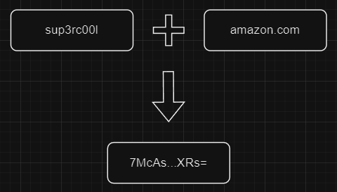

# Decoy
A password management system that doesn't store passwords.

# Introduction
Everyday it feels like there is a new leak in the news like: 
```
ATTENTION: 3 GAZILLION SOCIAL SECURITY NUMBERS LEAKED!!!
```
Often these leaks are the result of bad passwords, and it's no surprise considering an 8 digit password can be hacked in less than one hour.

You may be thinking, "Use a password manager like 1Password, that solves it!" The issue with those is they store your passwords, *albeit encrypted*, on their servers, what if they get hacked?
Decoy does not store any information about a user so you don't need to worry about that. You might say,"Okay then, just use a longer password and mix em up. Problem solved!" 
and you would be right. The issue with that is I'm *lazy* and I don't want to remember long passwords for different sites.

That's where Decoy comes in. All you need to know is **one** password and an identifier to let you know what the password is for.

Decoy generates 32 character passwords that should meet all the requirements imposed by apps nowadays. Good thing for you is that 32 characters will take roughly
1.6894617970400734e+42 years to crack or $771,433,818,790,075,000,000,000,000,000,000,000,000,000,000. Safe to say you probably won't get hacked :)

# Example
Let's call the password you know `master password` and the identifier `account identifier`. Say you wanted to store a password for amazon.com. 
You would enter in your master password `sup3rc00l` and the account identifier `amazon.com`. You'll get a generated password that is specific to these two inputs.
These inputs can be used to retrieve a previously generated password given they are the same inputs used before. This is possible due to the deterministic approach Decoy uses
when generating a password. Below is a diagram to help explain:



Each time `sup3rc00l` and `amazon.com` are used `7McAskn1t_HaERILsRfwWR0ja6hFvWwA-T3CTZjcXRs=` will be generated.

# Usage
You'll need Go installed. Follow this [doc](https://go.dev/doc/install) to install it if you haven't.

Once you have everything installed, you can run the following in the terminal:

```
$ git clone https://github.com/zacharygarwood/Decoy.git
$ cd Decoy
$ go run cmd/decoy.go
```

You'll see the following prompts appear one by one:

```
Enter master password: <super secret information> 
Enter account identifier: <information to determine the use of the password>
```
Go ahead and enter in the information. Once you do so you'll see a message like the one below with a generated password:
```
Generated password: 7McAskn1t_HaERILsRfwWR0ja6hFvWwA-T3CTZjcXRs=`
```

